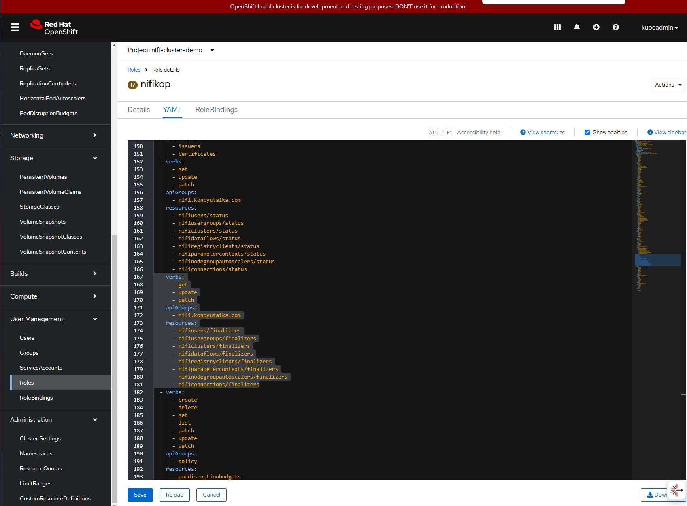

# Building Data Integration Plattforms in Openshift

....

## Introduction


## Installtion requirements


Local Installation of Openshift:
https://developers.redhat.com/products/openshift-local/getting-started

Video Tutorial:
https://youtu.be/yp8LXEKlGSQ

**Steps** 


* Please install / activate HyperV in Windows System.
* Download CRC from RedHat.
* Download the pull scret file and copy to user folder.
* Install CRC on Windows.

* Setup the CRC 

```
PS C:\Users\oguzhan.akyol> crc setup
INFO Using bundle path C:\Users\oguzhan.akyol\.crc\cache\crc_hyperv_4.17.10_amd64.crcbundle
INFO Checking minimum RAM requirements
INFO Check if Podman binary exists in: C:\Users\oguzhan.akyol\.crc\bin\oc
INFO Checking if running in a shell with administrator rights
INFO Checking Windows release
INFO Checking Windows edition
INFO Checking if Hyper-V is installed and operational
INFO Checking if Hyper-V service is enabled
INFO Checking if crc-users group exists
INFO Checking if current user is in crc-users and Hyper-V admins group
INFO Checking if vsock is correctly configured
INFO Checking if CRC bundle is extracted in '$HOME/.crc'
INFO Checking if C:\Users\oguzhan.akyol\.crc\cache\crc_hyperv_4.17.10_amd64.crcbundle exists
INFO Getting bundle for the CRC executable
INFO Downloading bundle: C:\Users\oguzhan.akyol\.crc\cache\crc_hyperv_4.17.10_amd64.crcbundle...
5.13 GiB / 5.13 GiB [--------------------------------------------------------------------------------------------------------------------------------------] 100.00% 41.90 MiB/s
INFO Uncompressing C:\Users\oguzhan.akyol\.crc\cache\crc_hyperv_4.17.10_amd64.crcbundle
crc.vhdx:  21.10 GiB / 21.10 GiB [-------------------------------------------------------------------------------------------------------------------------------------] 100.00%
oc.exe:  128.73 MiB / 128.73 MiB [-------------------------------------------------------------------------------------------------------------------------------------] 100.00%
INFO Checking if the win32 background launcher is installed
INFO Checking if the daemon task is installed
INFO Installing the daemon task
INFO Checking if the daemon task is running
INFO Running the daemon task
INFO Checking admin helper service is running
INFO Checking SSH port availability
Your system is correctly setup for using CRC. Use 'crc start' to start the instance
```

* Start the CRC 

```
PS C:\Users\oguzhan.akyol> crc start -p .\pull-secret.txt
INFO Using bundle path C:\Users\oguzhan.akyol\.crc\cache\crc_hyperv_4.17.10_amd64.crcbundle
INFO Checking minimum RAM requirements
INFO Check if Podman binary exists in: C:\Users\oguzhan.akyol\.crc\bin\oc
INFO Checking if running in a shell with administrator rights
INFO Checking Windows release
INFO Checking Windows edition
INFO Checking if Hyper-V is installed and operational
INFO Checking if Hyper-V service is enabled
INFO Checking if crc-users group exists
INFO Checking if current user is in crc-users and Hyper-V admins group
INFO Checking if vsock is correctly configured
INFO Checking if the win32 background launcher is installed
INFO Checking if the daemon task is installed
INFO Checking if the daemon task is running
INFO Checking admin helper service is running
INFO Checking SSH port availability
INFO Loading bundle: crc_hyperv_4.17.10_amd64...
INFO Creating CRC VM for OpenShift 4.17.10...
INFO Generating new SSH key pair...
INFO Generating new password for the kubeadmin user
INFO Starting CRC VM for openshift 4.17.10...
INFO CRC instance is running with IP 127.0.0.1
INFO CRC VM is running
INFO Updating authorized keys...
INFO Check internal and public DNS query...
INFO Check DNS query from host...
INFO Verifying validity of the kubelet certificates...
INFO Starting kubelet service
INFO Waiting for kube-apiserver availability... [takes around 2min]
INFO Adding user's pull secret to the cluster...
INFO Updating SSH key to machine config resource...
INFO Waiting until the user's pull secret is written to the instance disk...
INFO Changing the password for the kubeadmin user
INFO Updating cluster ID...
INFO Updating root CA cert to admin-kubeconfig-client-ca configmap...
INFO Starting openshift instance... [waiting for the cluster to stabilize]
INFO Operator console is progressing
INFO Operator authentication is not yet available
INFO All operators are available. Ensuring stability...
INFO Operators are stable (2/3)...
INFO Operators are stable (3/3)...
INFO Adding crc-admin and crc-developer contexts to kubeconfig...
Started the OpenShift cluster.

The server is accessible via web console at:
  https://console-openshift-console.apps-crc.testing

Log in as administrator:
  Username: kubeadmin
  Password: 

Log in as user:
  Username: developer
  Password: 

Use the 'oc' command line interface:
  PS> & crc oc-env | Invoke-Expression
  PS> oc login -u developer https://api.crc.testing:6443
```


## Nifi Operators 

...

### Stackable

...


### Nifikop

This guide descripts the installtion steps on windows.

#### Preconditions
  - Install Helm:
  https://docs.openshift.com/container-platform/4.10/applications/working_with_helm_charts/installing-helm.html#on-windows-10
  
  - Install Kubectl:


  - Login openshift as Administrator:
```
  & crc oc-env | Invoke-Expression
  oc login -u kubeadmin -p cktiF-....-txr9u https://api.crc.testing:6443
```

  - Get Uid from openshift project

```
  kubectl get namespace nifi -o=jsonpath='{.metadata.annotations.openshift\.io/sa\.scc\.supplemental-groups}'
```
  The result will be 1000650000/10000. The first part before ist he uid and second is the group id for my project.

#### Installation 

##### Install cert manager

```
# Install CustomResourceDefinitions first
kubectl apply --validate=false -f https://github.com/jetstack/cert-manager/releases/download/v1.7.2/cert-manager.crds.yaml

# Add the jetstack helm repo
helm repo add jetstack https://charts.jetstack.io
helm repo update

# You have to create the namespace before executing following command
helm install cert-manager --namespace nifi-cluster-demo --version v1.7.2 jetstack/cert-manager

```

##### Install State management / zookeeper

```
helm install zookeeper oci://registry-1.docker.io/bitnamicharts/zookeeper --set resources.requests.memory=10Mi --set resources.requests.cpu=10m     --set resources.limits.memory=256Mi --set resources.limits.cpu=250m --set global.storageClass=standard --set networkPolicy.enabled=true --set replicaCount=3 --set containerSecurityContext.runAsUser=1000650000 --set podSecurityContext.fsGroup=1000650000
```

##### Deploy nifikop

```
helm install nifikop oci://ghcr.io/konpyutaika/helm-charts/nifikop --namespace=nifi-cluster-demo --version 1.12.0 --set image.tag=v1.12.0-release --set resources.requests.memory=10Mi --set resources.requests.cpu=10m --set resources.limits.memory=256Mi --set resources.limits.cpu=250m --set namespaces='{"nifi-cluster-demo"}' --set runAsUser=1000650000
```

#### Deploy Nifi Cluster

//TODO...

## Problems & Solutions

**Error:**
```
Insufficient memory. preemption: 0/1 nodes are available: 1 No preemption victims found for incoming pod.


-> crc status
CRC VM:          Running
OpenShift:       Running (v4.17.10)
RAM Usage:       24.57GB of 32.68GB
Disk Usage:      7.699GB of 10.96GB (Inside the CRC VM)
Cache Usage:     28.35GB
```

Solution: CRC (Openshift Local) plattform on windows consumes high memory. For Nifi Cluster stack is unfortunately more memory needed. That why we switch to an on promise plafform with more capacities. On local machine it is not practicable.

**Error:**
```
pods "nifikop-794cf5875c-" is forbidden: unable to validate against any security context constraint: [provider "anyuid": Forbidden: not usable by user or serviceaccount, provider restricted-v2: .containers[0].runAsUser: Invalid value: 1000: must be in the ranges: [1000680000, 1000689999], provider "restricted": Forbidden: not usable by user or serviceaccount, provider "nonroot-v2": Forbidden: not usable by user or serviceaccount, provider "nonroot": Forbidden: not usable by user or serviceaccount, provider "hostmount-anyuid": Forbidden: not usable by user or serviceaccount, provider "machine-api-termination-handler": Forbidden: not usable by user or serviceaccount, provider "hostnetwork-v2": Forbidden: not usable by user or serviceaccount, provider "hostnetwork": Forbidden: not usable by user or serviceaccount, provider "hostaccess": Forbidden: not usable by user or serviceaccount, provider "hostpath-provisioner": Forbidden: not usable by user or serviceaccount, provider "privileged": Forbidden: not usable by user or serviceaccount]
```

**Error:**
```
{"level":"error","time":"2025-02-28T09:19:34.220Z","caller":"controller/controller.go:329","msg":"Reconciler error","controller":"nificluster","controllerGroup":"nifi.konpyutaika.com","controllerKind":"NifiCluster","nifiCluster":{"name":"nifidemo","namespace":"nifi-cluster-demo"},"namespace":"nifi-cluster-demo","name":"nifidemo","reconcileID":"b08ce287-194b-4ad9-b7cf-eb59f963e149","error":"failed to reconcile resource: creating resource failed: services \"nifidemo-all-node\" is forbidden: cannot set blockOwnerDeletion if an ownerReference refers to a resource you can't set finalizers on: , <nil>","errorVerbose":"creating resource failed: services \"nifidemo-all-node\" is forbidden: cannot set blockOwnerDeletion if an ownerReference refers to a resource you can't set finalizers on: , <nil>\nfailed to reconcile resource\ngithub.com/konpyutaika/nifikop/pkg/resources/nifi.(*Reconciler).Reconcile\n\t/workspace/pkg/resources/nifi/nifi.go:132\ngithub.com/konpyutaika/nifikop/internal/controller.(*NifiClusterReconciler).Reconcile\n\t/workspace/internal/controller/nificluster_controller.go:148\nsigs.k8s.io/controller-runtime/pkg/internal/controller.(*Controller).Reconcile\n\t/go/pkg/mod/sigs.k8s.io/controller-runtime@v0.17.0/pkg/internal/controller/controller.go:119\nsigs.k8s.io/controller-runtime/pkg/internal/controller.(*Controller).reconcileHandler\n\t/go/pkg/mod/sigs.k8s.io/controller-runtime@v0.17.0/pkg/internal/controller/controller.go:316\nsigs.k8s.io/controller-runtime/pkg/internal/controller.(*Controller).processNextWorkItem\n\t/go/pkg/mod/sigs.k8s.io/controller-runtime@v0.17.0/pkg/internal/controller/controller.go:266\nsigs.k8s.io/controller-runtime/pkg/internal/controller.(*Controller).Start.func2.2\n\t/go/pkg/mod/sigs.k8s.io/controller-runtime@v0.17.0/pkg/internal/controller/controller.go:227\nruntime.goexit\n\t/usr/local/go/src/runtime/asm_amd64.s:1700","stacktrace":"sigs.k8s.io/controller-runtime/pkg/internal/controller.(*Controller).reconcileHandler\n\t/go/pkg/mod/sigs.k8s.io/controller-runtime@v0.17.0/pkg/internal/controller/controller.go:329\nsigs.k8s.io/controller-runtime/pkg/internal/controller.(*Controller).processNextWorkItem\n\t/go/pkg/mod/sigs.k8s.io/controller-runtime@v0.17.0/pkg/internal/controller/controller.go:266\nsigs.k8s.io/controller-runtime/pkg/internal/controller.(*Controller).Start.func2.2\n\t/go/pkg/mod/sigs.k8s.io/controller-runtime@v0.17.0/pkg/internal/controller/controller.go:227"}
```


Solution: Missing resources in Nifikop Role.Please add the following resources to this api group.

```
  - verbs:
      - get
      - update
      - patch
    apiGroups:
      - nifi.konpyutaika.com
    resources:
      - nifiusers/finalizers
      - nifiusergroups/finalizers
      - nificlusters/finalizers
      - nifidataflows/finalizers
      - nifiregistryclients/finalizers
      - nifiparametercontexts/finalizers
      - nifinodegroupautoscalers/finalizers
      - nificonnections/finalizers

```



## Comparision of operators

Comparision criterieas

* Support for Apache Nifi 2.x 
* Performance 
* Installation comfortable & reliable
* Configuration comfortable & reliable

